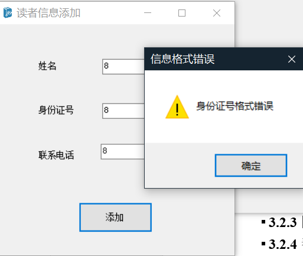
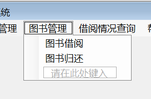

# 基于BaiduAI的人脸识别智能图书管理系统设计与实现

# 1 系统概述

图书馆借阅管理系统中如何有效识别读者身份又能保护读者隐私是智能化管理的重要环节，目前的校园卡是针对卡片的识别，易被盗用[1]；而基于指纹识别的身份鉴别的接触性和易破坏性[2]
[3]，在新冠疫情之后更加难以实现。

基于BaiduAI的人脸识别智能图书管理系统以传统的图书管理系统为开发的基础，实现了利用人脸识别技术进行借阅、客户账号信息管理、图书借阅管理、图书信息管理以及管理员信息管理等功能。系统将用户划分为三类，分别为读者类，工作人员类以及管理人员类，并且设立了6张数据库表格进行关联，有效的实现了面部图书借阅，图书管理系统基础功能等多功能。

## 系统设计目的与意义

### 1.1.1 项目背景调研

随着我国国民经济的快速发展和人民生活水平的不断提高，人们对于精神生活质量也更加重视，全国各地也是不断地开设图书馆同时图书馆的藏书、阅读人次也不断地增加，这给图书管理工作提出了新的挑战[4]
[5]。传统图书管理系统由于存在：需要工作人员进行配合借阅、用户安全等级不高，易被盗用、借书不够便捷，智能化程度不高等诸多问题。传统的人工流水技术已经不能适应当代环境。

随着加密技术与解密技术的不断更新，传统的账号、密码容易产生暴力破解，于此同时数据库也更加容易遭受到注入式攻击[6]。人脸识别技术的运用，在提高安全性的同时，也提高了程序的便捷性和智能性[7]。但是许多信息系统将人脸文件存储在本地，用户人脸信息得不到保障，容易被破解。普通的Hear-Like分类器的人脸识别也存在精确度不高等缺点[8]
[9]。

### 1.1.2 系统设计意义

在此我们推出了基与BaiduAI的人脸识别智能图书管理系统，不仅可以识别读者的身份，还可以进行管理人员身份识别，提高图书馆管理效率，而且还可以为读者借阅提高方便。团队提出基于BaiduAI的人脸识别智能图书管理系统。

基于BaiduAI的人脸识别智能图书管理系统的推出拥有以下几大优点:

1.  提高图书管理的效率

相对于以往的图书借阅，借阅人无需自己亲自去核实是否有书在馆，只需要在系统上查询即可；图书管理员对于图书信息的更改也无需告诉每一位借阅者，只需要在系统上进行信息更改；

1.  提高图书馆的服务质量

在以往的图书借阅的过程中，获取属于一本适合自己的书，需要不断地通过朋友、老师得推荐，而智能图书系统可以通过大数据分析进行推荐；以往的图书管理对于一本书的评论需要亲自阅读目录或者从书友口中得知，而智能图书系统中，你只要在该书的评论中就可以得知你想知道的一切；

1.  操作简单、流程更加清晰

智能图书管理系统将读者、工作人员、管理员分别就于不同的系统中，但各个系统通过数据库中的信息进行密切联系，将借书的流程进行数字化的实现。系统操作简单，也省去许多培训的钱，以便将钱用在图书采购等中。

## 1.2 系统功能需求

信息的增加、删除、查询、更改：利用到VS中SQLCommand模块对数据库中的相关信息进行操作，在将数据库中的信息储存并准备执行下一步操作；

登录操作：用户输入正确的账号、密码并选择对应的身份，再调用相关的表，执行信息核查，正确后才能进入主界面；

面部识别：在用户注册面部信息后，会将相应的面部信息进行存储，在下一次执行刷脸登录时，会调用人脸识别方法，进行识别登陆。

## 1.3 系统开发环境与技术

该系统开发环境为SQL2008、VS2019的开发环境，在开发的过程中主要运用了数据库的连接、数据的查找、替换、删除、增加，人脸识别技术等技术。

表格 1 配置说明

| 配置       | 软件                                                 |
|------------|------------------------------------------------------|
| 本机配置   | Windows 10家庭中文版                                 |
|            | Microsoft Visual Studio Professional 2019版本15.9.20 |
| 虚拟机配置 | Windows 2003 sever                                   |
|            | Microsoft Visual Studio 2010                         |
|            | SQL Sever 2008                                       |

# 2 系统设计与基础实现

系统主要由：用户层、工作人员层、管理员层和数据库层，四个方面组成，分别对应着用户端、工作人员端、管理员端和数据端。

图 2 用户功能展示

## 2.1 用户端

在用户端中，用户通过人脸识别进行登录，登陆成功后可以进行图书的借阅和还书操作。在用户界面中会根据当时时间进行记录借阅和还书时间，并存入数据库。在借书和还书中的ISBN码选项中，用户可以自行输入或者利用扫描技术。

## 2.2 工作人员端

在工作人员端中，可以分为读者管理、功能管理、登录模块。在读者模块中，主要是对读者信息进行查询并显示、读者信息添加、查阅读者类别、删除读者信息、添加读者类别以及注册人脸。在功能模块中，主要是实现图书的归还、借阅、查询图书记录和查阅读者阅读情况的功能。在登录模块中，主要是实现工作人员的密码重置和账号登录功能。

## 2.3 管理员端

在管理员端中，主要是实现普通管理员未能实现的功能。

## 2.4 数据端

数据端是连接用户端、工作人员端和管理员端的连接线，数据端由四大数据表组成，分别是：读者信息表、书籍信息表、管理员表和借阅信息表。读者信息表储存学号、姓名、电话、是否为失信读者信息，书籍信息表储存ISBN、书名第一作者、出版社、出版年份、价格、库存数量、借出数目、平均分以及评分人数组成。在管理员表中由工号、姓名、电话组成，借阅信息表由学号、ISBN、节约时间、还书时间、是否续借、是否已还、超时扣款组成。

图 3 系统设置

# 3 基与BaiduAI的人脸识别智能图书管理系统实现

## 3.1登录模块

登录模块为打开软件看到的第一个模块，当工作人员和管理员输入正确的用户名和密码才能进入软件系统的主界面。

图 12 登录界面

登录按钮对于“管理员”与“工作人员”进行识别，匹配“Manager”表中的mIdentity，并结合用户名与密码进行匹配登录。

图 13 “登录”按钮代码

图 14 登录工作人员界面成功提示

## 3.2工作人员界面

本界面左上角有本团队自主设计的LOGO，右上角有当前时间，来提示工作人员此时的时间；在这个界面主要实现工作人员的以下功能：个人管理、读者管理、图书管理、借阅情况查询和帮助。

>   

-   时间模块

    

图 15 时间控件与实现代码

### 3.2.1 个人管理

个人管理主要分为

图 16 个人管理相关子菜单

图 17 注销按钮

当用户点击注销选项，会提示是否注销的提示框，如果选择注销，该页面关闭。

图 18 退出按钮

当用户选择退出选项，会弹出消息框是否退出的提示，如果选择，会退出当前程序。

图 19 修改工作人员密码按钮

### 3.2.2读者管理

图 20 读者管理子菜单展示

#### （1）添加读者信息

>   

图 21 读者信息添加

>   

图 22 若身份证位数不对会自动判断，防止出现身份证号码不对的情况

图 23 读者信息添加代码

在添加用户时，如果输入的用户信息不完整，会提示不完整，如果格式出现错误也会提出相应提示，如身份证密码格式错误，电话号码必须为数字。

#### （2）修改读者信息

图 24 窗口展示

图 25 预览信息按钮

图 26 修改信息按钮的防止BUG语句

在修改信息的时候，如果有部分信息没有填写，会提出信息不完整。

图 27 修改信息按钮的判断语句

#### （3）添加读者人脸信息

使用videoSourcePlayer来作为展现视频流的窗口，能够将摄像头捕捉的内容传输到画面中

图 28 添加读者面部信息界面

图 29 “注册”按钮实现

图 30 测试按钮实现

### 3.2.3图书管理

图 31 图书管理子菜单展示

#### （1）图书借阅

图 32 图书借阅窗口展示

图 33
借阅图书判断代码：主要针对ISBN、库存、身份证、超期未还书籍等多重信息进行判断，防止出现BUG，也是本次信息系统修改最多的地方，设计到较多的判断语句。

#### （2）图书归还

图 34 还书界面展示

### 3.2.4图书借阅情况查询

图 35 图书借阅情况查询展示

## 3.3管理员界面

时间显示与工作人员界面相同，不再复述。

图 36 管理人员系统 主界面展示

### 3.3.1系统设置

图 37 系统设置展示

### 3.3.2工作人员管理

图 38 工作人员管理子菜单显示

#### 添加工作人员

图 39 添加工作人员界面

图 40 添加工作人员代码

在添加工作人员时，如果有一部分信息没有填写，会提示出代码完整的提示，在密码和确认密码两个栏中，如果密码不一致，会提示“两次密码不一致，添加失败”提示，如果没有错误，会提示添加成功。

#### （2）修改工作人员

>   

图 41修改工作人员

### 3.3.3图书管理

图 42图书类别管理

图 43图书信息管理

#### 添加图书

在添加图书信息的过程中，如果书的ISBN码、、书名、第一作者、图书类别、库存数目、价格有一个选项为空，则系统都会提示相应错误，如“书名不能为空”等，如果没有错误，点击确认添加后，会将提示信息添加成功，如果在插入的过程出错会提示数据库出错。

图 44添加图书

图 45添加图书代码（一）

图 46添加图书代码（二）

#### （2） 添加图书类别

图 47添加图书类别

图 48添加图书类别代码

#### （3） 修改图书类别

图 49修改图书类别

图 50修改图书类别代码

#### （4）修改书籍信息

>   

图 51修改图书信息

#### （5） 查询类别

图 52类别查询

图 53类别查询代码

#### （6）书本查询

图 54书本查询

图 55书本查询代码

## 3.4 读者自助借书界面

图 56登录界面

图 57借阅图书界面

图 58 登录按钮

图 59 查找按钮

图 60 确定借阅按钮

# 4 程序调试与分析

## 4.1系统调试问题

系统在调试的过程中，面临以下几个问题。

### 4.1.1多人操作导致系统混乱

在系统的基本框架做好后，每个组员将做好的部分进行重组的过程中，由于每个组员的命名规则不同，在部分功能实现的过程中思路的不一致，导致很难将系统的控件和相关方法进行连接，以及实现页面和控件的不统一。

### 4.1.2刷脸过程的实现和ISBN扫描借书

如何让用户进行刷脸登录和ISBN扫码借书是智能图书管理系统的一大难点，在刷脸登录功主要面临的问题为：如何进行人脸的存储，以及人脸登录时人脸的识别。在扫描借书功能的实现中，如何将扫描的码和书的类别进行连接，以及扫码借书中如何将扫描的码也就是图片信息转换成数据库中的字符串信息。

### 4.1.3数据库的构建

在系统设计时，涉及到读者、工作人员、管理员三个层次，每个层次的数据权限有所不同，同时考虑到过度收集导致数据冗余、用户信息安全和程序运行效率问题，巧妙地设计好一个数据库显得尤其重要。

## 4.2解决办法

在解决以上的问题中，我们小组在进行第一次重组后，形成了一个类目表，详细的标明每一个控件的名字以及相应的功能，在命名上保持高度一直，页面设计遵循功能的原则，即一功能一控键，类似功能用容器进行整合。

在人脸识别登录中，我们将不断地进行尝试，由于在全网并未找到可以参考的文档，并且百度调用的文档写的十分简陋，故根据相关返回值，经过团队长达两个星期的高达五十次的测试最终解决了此问题，能够实现
完美自助借书体验。

# 5 声明

本程序由海南大学2018级信息管理与信息系统班 孙逸龙、吴天楚、李家成共同完成，如需使用,必须注明出处！

# 6 参考文献

[1]李南汐,黄炜辰,谢心怡.关于“电子校园卡”的研究——基于上海市四所普通高校的调查与分析[J].现代商业,2020(09):39-41.

[2]卞银龙. 基于深度学习的人群行为分析关键技术研究[D].电子科技大学,2020.

[3]刘晓霞. 公共文化服务视角下的上海近代图书馆发展研究[D].上海师范大学,2019.

[4]蔡成飞. 基于人脸识别技术和边缘计算技术的智能系统研究[D].浙江大学,2018.

[5]陈铁明. 网络空间安全实战基础[M].人民邮电出版社:, 201802..

[6]宇路. 基于指纹识别技术的图书馆借阅系统应用的研究[D].东南大学,2017.

[7]李延枫. 基于眼部识别的疲劳驾驶检测系统设计[D].成都理工大学,2017.

[8]李剑昆. 基于人脸识别的用户信息采集与匹配系统[D].北京邮电大学,2017.

[9]王之涵. 无人值守变电站中智能视频分析技术研究及实现[D].华北电力大学,2017.

[10]秦志光,张凤荔. 计算机病毒原理与防范[M].人民邮电出版社:, 201601..

[11]申晓娟. 面向公共图书馆服务体系建设的图书馆事业政策研究[D].武汉大学,2013.

[12]周薇娜. 人脸检测算法及其芯片实现关键技术研究[D].复旦大学,2012.

[13]王丽颖. 面向教学管理的安全信息系统的设计与实现[D].天津大学,2006.
